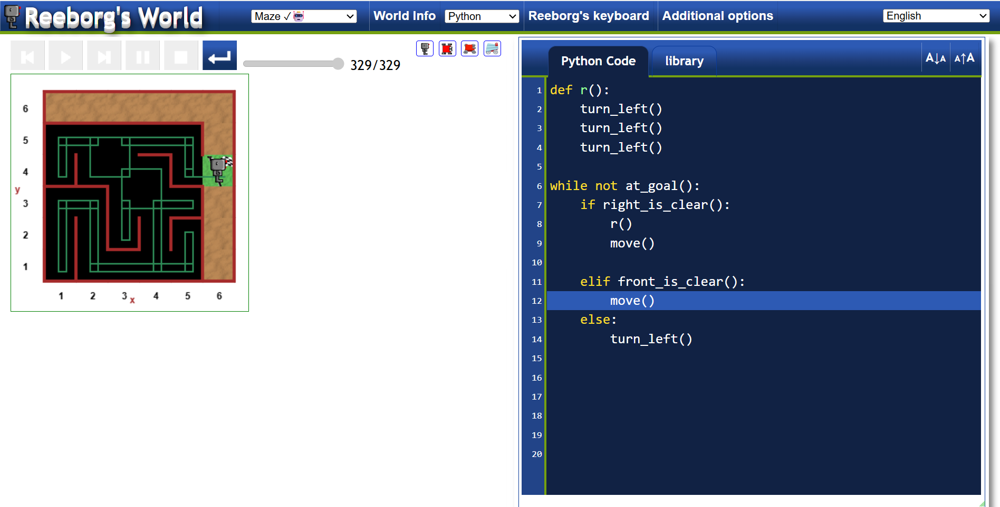

## Conclusion

Day 06 helped me understand **loops in Python**, especially the use of `for` and `while` loops and the difference between them. I also practiced these concepts through different challenges on **Reeborg's World**, which helped me understand how loops execute and how they can be used to solve problems step by step.

As the final challenge for today, I worked on **solving a maze in Reeborg's World** using the approach taught by Angela Yu. I was able to understand and implement the basic logic required to navigate through the maze.

For now, I have completed the implementation part of the challenge. I will work on **debugging, optimizing, and understanding the logic more deeply** after completing my basic Python learning, so that I can revisit the problem with a stronger understanding of the concepts involved.

### Exercise 4

Overall, Day 06 was a good step toward improving my **logical thinking, problem-solving skills, and understanding of loops through practical challenges**.
